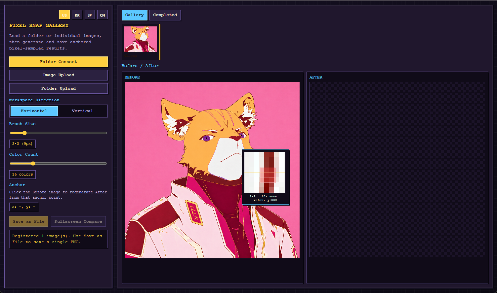
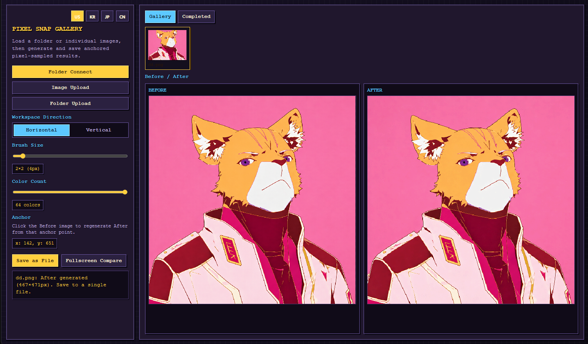
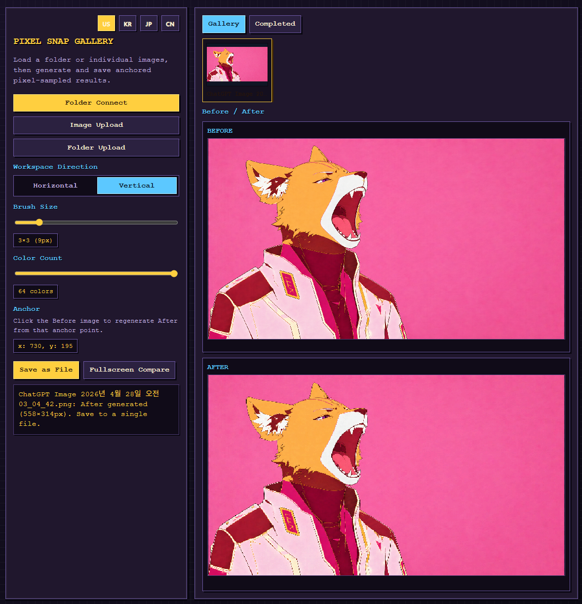
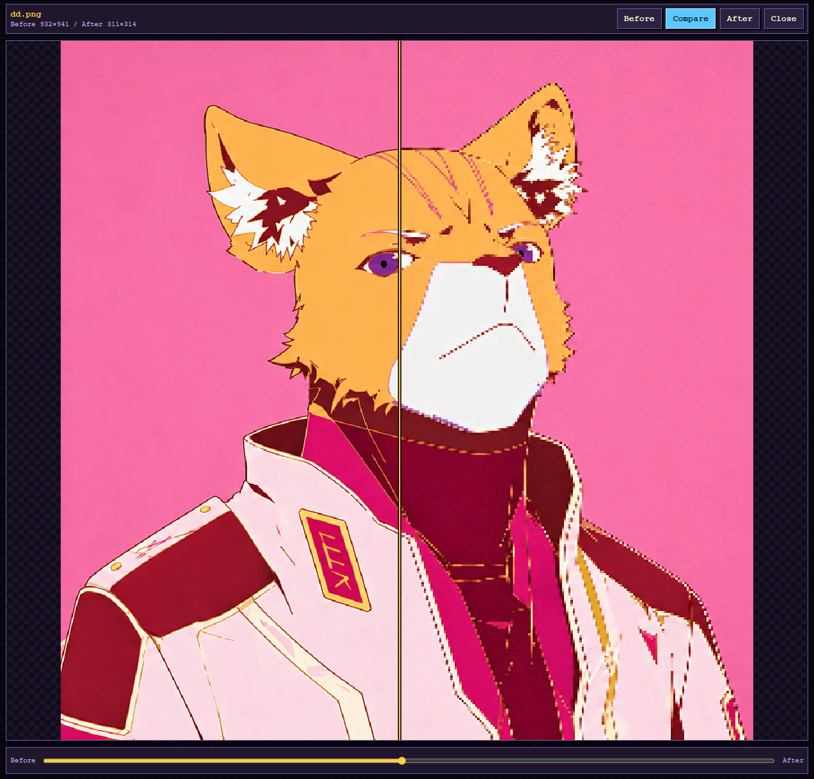

# Gridloom Pixel Studio

Gridloom Pixel Studio is a browser-based utility for converting regular images into anchored pixel-sampled PNG output. It keeps the source image at its original pixel dimensions while you choose a brush anchor, preview the exact brush footprint, and generate a reduced pixel-art result.

## Screenshots

### Brush Picker



### Horizontal Workspace



### Vertical Workspace



### Fullscreen Compare



## Features

- Load images from a writable local folder with the File System Access API.
- Load a single image directly without adding it to the gallery.
- Folder connection populates the gallery with many images from that folder.
- Preserve the original source image resolution in the Before workspace.
- Choose a square brush size from `1x1` to `16x16`.
- Pick an anchor point directly on the Before canvas.
- Show the actual brush footprint as a red `NxN` grid over the image.
- Show a pixel magnifier around the picker.
- Scale the magnifier zoom based on the current brush size.
- Render the red brush footprint inside the magnifier so the sampled area is clear.
- Generate an After image by sampling one output pixel per brush block.
- Quantize color with a configurable color-count slider.
- Save results back to the connected folder when available.
- Save single-file results through a save dialog, with download fallback.
- Switch the workspace between horizontal and vertical Before/After layouts.
- Open a fullscreen comparison view.
- Compare Before and After with buttons or a left/right wipe slider.
- Display images with pixelated rendering so the browser does not smooth the preview.
- Switch the UI language with flag buttons.
- Supported UI languages: English, Korean, Japanese, and Chinese.
- English is the default UI language.
- Run batch conversion from a folder.
- Remove images from the batch list before converting.
- Add extra images to a batch.
- Save all batch outputs into a selected output folder.
- Write a `.txt` sidecar file for each batch output with YAML frontmatter metadata.
- Review batch outputs in the Completed tab with the same compare viewer.

## How It Works

The Before canvas uses the original image pixel dimensions. It is only scaled visually by CSS to fit the workspace.

When you click the Before canvas, the tool treats that point as the brush anchor. The selected brush size defines an `NxN` source pixel block. The After image is generated by sampling the anchored grid and writing one pixel for each brush block. This means the After image is intentionally smaller than the original when the brush size is greater than `1x1`.

Example:

- Source image: `1400x900`
- Brush size: `4x4`
- Result image: roughly `350x225`

The exact output size can shift slightly depending on the selected anchor because the grid alignment changes.

## Run Locally

From the project directory:

```bat
run.bat
```

Or run the server manually:

```bash
python -m http.server 4173
```

Then open:

```text
http://127.0.0.1:4173/
```

You can also use:

```bash
python3 -m http.server 4173
```

## Basic Workflow

1. Open the app in a browser.
2. Use the flag buttons to choose a UI language if needed.
3. Click `Folder Connect` to populate the gallery from a writable folder, or use `Image Upload` to open one image directly.
4. If you connected a folder, select an image from the gallery. Direct image upload opens immediately in the workspace.
5. Adjust the brush size slider.
6. Move the pointer over the Before image to inspect pixels with the magnifier.
7. Click the Before image to set the anchor and generate the After image.
8. Use `Fullscreen Compare` to inspect Before and After.
9. Save the result as a PNG.

## Batch Conversion

Click `Batch Convert` to start a folder-based batch conversion.

Batch workflow:

1. Select a source folder.
2. The batch modal loads the folder images in a gallery-style list.
3. Remove unwanted images with the `x` button.
4. Add more images with `Add Images`.
5. Choose the batch brush size and color count.
6. Click `Convert All`.
7. Select an output folder.
8. The app writes converted PNG files and `.txt` sidecar metadata files into the output folder.
9. Converted images are added to the `Completed` tab for comparison.

Each sidecar text file includes frontmatter like:

```yaml
---
source: "source-image.png"
after_image: "source-image_after.png"
brush_size: 4
color_count: 16
anchor_x: 700
anchor_y: 450
source_width: 1400
source_height: 900
after_width: 350
after_height: 225
converted_at: "2026-04-28T00:00:00.000Z"
---
Generated by Gridloom Pixel Studio.
```

## Workspace Layout

The workspace can be switched between:

- Horizontal: Before and After side by side.
- Vertical: Before and After stacked.

This only changes the display layout. It does not change image processing.

## Fullscreen Compare

After an image is generated, click `Fullscreen Compare`.

Available comparison modes:

- `Before`: show only the original image.
- `After`: show only the generated pixel result.
- `Compare`: show a wipe comparison controlled by a slider.

The comparison view uses pixelated rendering to avoid browser smoothing.

## Browser Notes

Folder saving uses the File System Access API, which is best supported in Chromium-based browsers.

If the browser does not support folder or save handles, direct image upload and PNG download still work.

## Files

- `index.html`: app shell and script includes.
- `app.js`: React app, image loading, picker, magnifier, processing, saving, and compare view.
- `styles.css`: pixel-style UI theme and responsive layout.

## License

MIT License. See [`LICENSE`](LICENSE).
